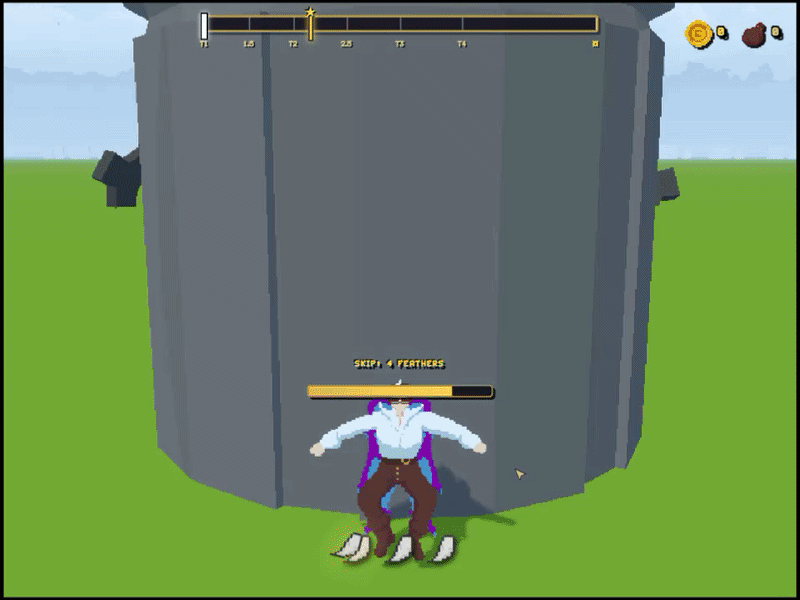
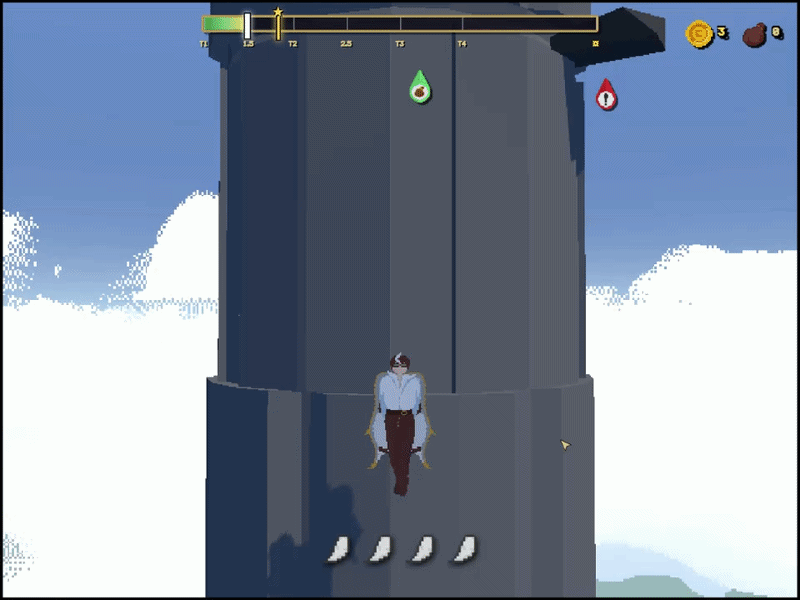
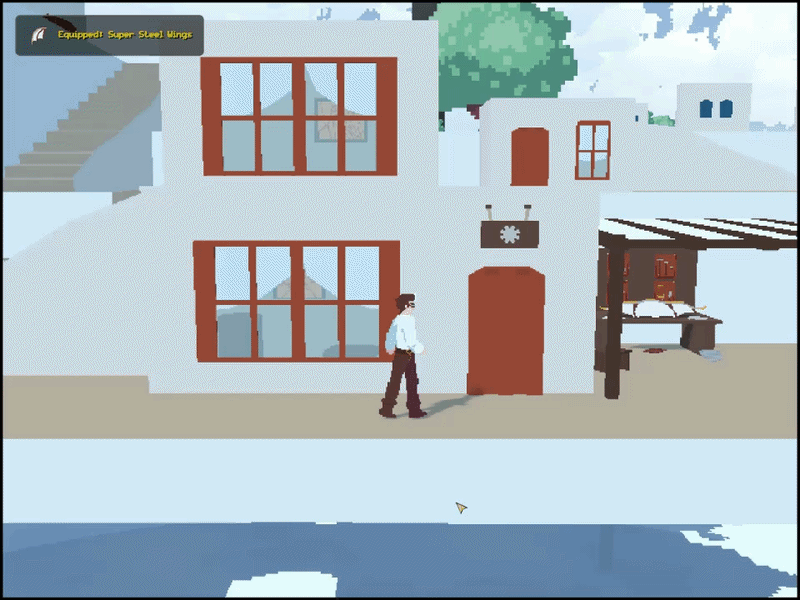

# ☀️ Closer to the Sun

### A vertical exploration game about climbing higher, gathering resources and building better wings.

<a href="https://youtu.be/3LuoDnCql2k">▶ WATCH GAMEPLAY</a>
<a href="https://dahaton.itch.io/closer-to-the-sun">🌐 PLAY IN BROWSER</a>



---

## ☀️ The Idea

**Closer to the Sun** is a 2D/3D game built around a repeating cycle of **climbing, gathering, crafting and upgrading**.

The player begins each run at the bottom of a massive tower and has to climb as high as possible while collecting resources and money along the way.

The higher the player gets, the more valuable resources and more advanced wing recipes become available.

After the climb, the player returns to the city to prepare for the next attempt.

---

## 🔄 The Gameplay Loop

```text
        🗼 CLIMB THE TOWER
                ↓
       COLLECT RESOURCES
                ↓
          EARN MONEY
                ↓
         REACH NEW HEIGHTS
                ↓
             🏙️ CITY
                ↓
      ┌─────────┼─────────┐
      ↓         ↓         ↓
   UPGRADE    BUY       TALK TO
    WINGS    RESOURCES    NPCs
      └─────────┼─────────┘
                ↓
          🗼 CLIMB AGAIN
```

Each run gives the player resources needed to improve their equipment and reach even greater heights on the next attempt.

---

## 🗼 Climbing the Tower

The main gameplay takes place around a huge tower.

The player continuously ascends while moving around its structure, collecting resources and money along the way.

The higher the player climbs:

* More valuable resources become available
* Better wing recipes are unlocked
* New progression opportunities open up

The player can also temporarily **accelerate their ascent**, but the ability has a limited number of uses per climb.

This creates a simple resource-management decision:

> **Use your acceleration now, or save it for later?**

---

## 🪽 Wings & Progression

Wings are the main part of the player's progression.

Resources collected during climbs can be used in the city to improve the player's wings and unlock more advanced recipes.

Progression therefore follows a simple cycle:

```text
CLIMB HIGHER
     ↓
FIND BETTER RESOURCES
     ↓
UNLOCK BETTER RECIPES
     ↓
BUILD BETTER WINGS
     ↓
CLIMB HIGHER
```

---

## 🏙️ The City

After completing a climb, the player returns to the city.

The city acts as the preparation and progression hub between runs.

Here the player can:

* 🪽 Upgrade their wings
* 🧱 Purchase resources needed for crafting
* 💬 Talk to NPCs
* 🔁 Prepare for the next climb

Talking to NPCs is optional, allowing the player to focus entirely on progression or explore the world and its characters at their own pace.

---

# 👥 Team

**Closer to the Sun** was developed as a two-person project.

### 🎨 Andrii "coyz_hiv" Lavrinchuk

**Idea · Game Design · Visual Direction · 2D Art**

My responsibilities included:

* Original game concept
* Game design
* Gameplay design
* Visual style and direction
* 2D assets
* Some gameplay programming
* Prototyping and iteration

I focused primarily on defining how the game should **look and play**, while also implementing parts of its gameplay logic.

---

### 💻 Dahaton

**Idea · Programming · 3D Art · Programming**

Responsibilities included:

* Game concept development
* Programming
* Gameplay implementation
* 3D assets
* Technical development
* Prototyping and iteration

Aleksandr focused primarily on the game's **programming and 3D side**, while also contributing to the overall game concept and design.

---

## 🛠️ Development

**Engine:** GDevelop (previously) / Three.js
**Project Type:** Team Project
**Genre:** Vertical Exploration / Progression
**Team Size:** 2

### Development Focus

`GAME DESIGN` · `GAMEPLAY` · `2D ART` · `3D ART` · `PROGRAMMING`

---

## 📸 Screenshots




---

## 🎥 Gameplay

▶ **[Watch the gameplay video](https://youtu.be/3LuoDnCql2k)**

---

## 🌐 Play in Browser

**[Play Closer to the Sun](https://dahaton.itch.io/closer-to-the-sun)**

---

## 📚 Project Information

|                      |                                                       |
| -------------------- | ----------------------------------------------------- |
| **Engine**           | GDevelop                                              |
| **Team**             | 2 developers                                          |
| **Genre**            | Vertical Exploration / Progression                    |
| **Platform**         | Browser                                               |
| **My Role**          | Game Design · 2D Art · Visual Direction · Programming |
| **Aleksandr's Role** | Programming · 3D Art · Game Design                    |
| **Status**           | Completed                                             |

---

<p align="center">

# ☀️ CLIMB HIGHER. BUILD BETTER. FLY FURTHER.

</p>
